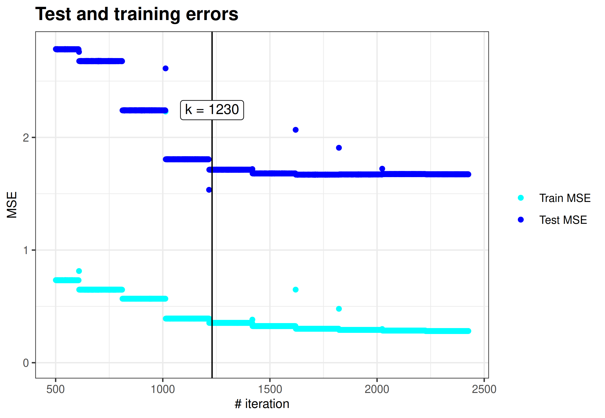
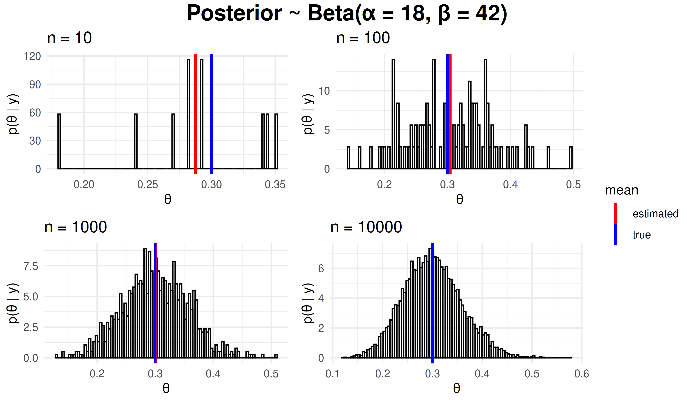
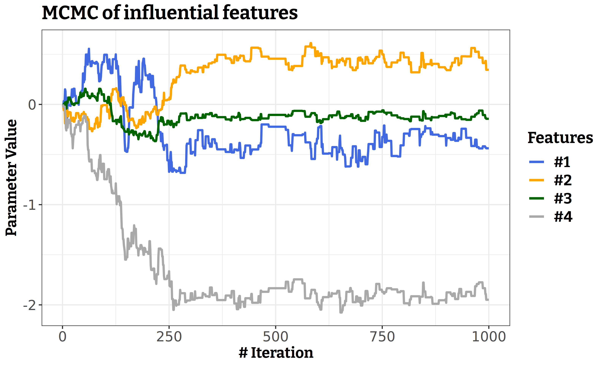
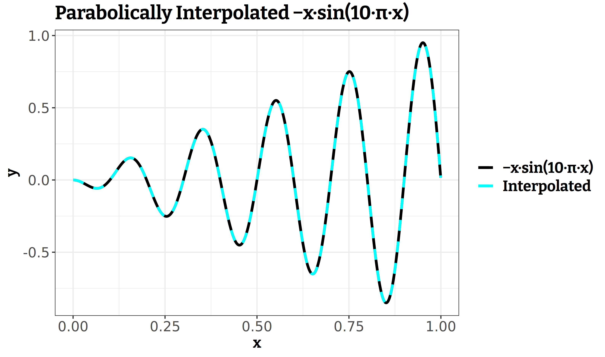

```{r setup, include=FALSE}
knitr::opts_chunk$set(echo = TRUE)

library(ggplot2)
library(gridExtra)
library(grid)

```

# Statement of Contribution

The plots for Convergence to the True Mean and MCMC Parameter Simulation for Poisson Regression were created with collaboration with Farid Musayev.

# Implicit Regularisation

```{r echo=F, message = FALSE, warning = FALSE, fig.align='center', out.width="70%"}

```

**Interpretation:** This plot shows how the mean squared error (MSE) changes with the number of iterations of gradient descent. The parameters are optimized implicitly. We see that the test MSE does not decrease significantly after the 1230-th iteration. Thus, the earlt stopping criterion can be used to avoid wasting computational resources.

# Convergence to the True Mean

```{r, echo=F, message = FALSE, warning = FALSE, fig.align='center', out.width="90%"}

```

**Interpretation:** We sample data from the binomial distribution. With increasing number of sampled data points, the mean of the sampled data points converges to the true calculated mean of the binomial distribution. When $n = 1000$,  it is difficult to distinguish between the true mean and estimated mean.

# MCMC Parameter Simulation for Poisson Regression

```{r, echo=F, message = FALSE, warning = FALSE, fig.align='center', out.width="70%"}

```

**Interpretation:** We use the Metropolis Hastings algorithm to simulate the parameters of Poisson Regression. The plot above demonstrates how four parameters corresponding to four features converge after about 250 iterations.

# Parabolic Approximation

```{r, echo=F, message = FALSE, warning = FALSE, fig.align='center', out.width="70%"}

```

**Interpretation:** In the plot above, one can observe how good is parabolic approximation using the gradient descent algorithm. The black line shows the real function, and the dashed cyan line shows the approximated values.

# Appendix

## Code for implicit regularisation

```{r eval=F}
data <- read.csv("communities.csv")

n <- dim(data)[1]

# Rename the target variable ViolentCrimesPerPop as target
names(data)[names(data) == "ViolentCrimesPerPop"] <- "target"

# Divide the data
data <- as.data.frame(scale(data))
set.seed(12345) 
id = sample(1:n, floor(n * 0.5)) 
train = data[id, ]
#print(dim(train)) #997 entries

test = data[-id, ]
#print(dim(test)) #997 entries

error_tr <- c()
error_test <- c()

cost <- function(par, data){
  tr <- mean((train$target - par %*% t(as.matrix(train[-101])))^2)
  error_tr <<- c(error_tr, tr)
  error_test <<- c(error_test, 
                   mean((test$target - par %*% t(as.matrix(train[-101])))^2))
  return(tr)
}

opt <- optim(par = rep(0, 100), fn = cost, method = "BFGS", 
             control = list(maxit = 12)) 

# Plots:
df <- cbind.data.frame(x = 1:length(error_tr), error_tr = error_tr,
                       error_test = error_test)
plot <- ggplot(df, aes(x = x)) + 
  theme_bw() +
  geom_point(aes(y = error_tr, colour = "1")) +
  geom_point(aes(y = error_test, colour = "2")) +
  xlab("# iteration") +
  ylab("MSE") +
  xlim(c(501, length(error_tr))) +
  ylim(c(0, error_test[400])) +
  geom_vline(xintercept = 1230) +
  annotate(x = 1230, y = 2.5, label = "k = 1230", 
                    vjust = 2, geom = "label") +
  labs(title = "Test and training errors") +
  scale_color_manual(name = NULL, 
                     labels = c("Train MSE", "Test MSE"), 
                     values = c("cyan", "blue")) +
  theme(title = element_text(size = 12, face = 'bold'),
        axis.title = element_text(size = 10, face = "plain"))
print(plot)
```

## Code for convergence to the true mean

```{r, eval = FALSE}
# Set seed
set.seed(12345)

# Given:
s = 13
n = 50
f = n - s
alpha_0 = 5
beta_0 = 5

# Beta Posterior distribution
beta_posterior <- function(n, s = 13, f = 37){
  alpha_0 = 5
  beta_0 = 5
  rbeta(n = n, shape1 = alpha_0 + s, shape2 = beta_0 + f)
}

# True expected value and standard deviation
expected_value <- (alpha_0 + s)/ ((alpha_0 + s) + (beta_0 + f))

variance <- (alpha_0 + s) * (beta_0 + f)/(((alpha_0 + s) + (beta_0 + f))**2*
                                            (alpha_0 + s + beta_0 + f + 1))
std <- variance**0.5

# Theta values generated from beta posterior for different n
df <- data.frame(theta_10 = beta_posterior(n = 10),
                 theta_100 = beta_posterior(n = 100), 
                 theta_1000 = beta_posterior(n = 1000),
                 theta_10000 = beta_posterior(n = 10000))

# Plots for different n values 

# n = 10
pl1 <- ggplot(df) +
  geom_histogram(aes(x = theta_10, y = ..density.., ), 
                 fill = "lightgrey", bins = 100, color = "black", alpha = 0.2) +
  geom_vline(aes(xintercept = mean(theta_10), color = "estimated"), size = 1) +
  geom_vline(aes(xintercept = expected_value, color = "true"), size = 1) +
  scale_color_manual(name = "mean", values = c(estimated = "red", true = "blue")) +
  labs(title = "n = 10", x = "\u03B8", y = "p(\u03B8 | y)") +
  theme_minimal() + theme(legend.position = "none")

# n = 100
pl2 <- ggplot(df) +
  geom_histogram(aes(x = theta_100, y = ..density.., ), 
                 fill = "lightgrey", bins = 100, color = "black", alpha = 0.2) +
  geom_vline(aes(xintercept = mean(theta_100), color = "estimated"), size = 1) +
  geom_vline(aes(xintercept = expected_value, color = "true"), size = 1) +
  scale_color_manual(name = "mean", values = c(estimated = "red", true = "blue")) +
  labs(title = "n = 100", x = "\u03B8", y = "p(\u03B8 | y)") +
  theme_minimal() + theme(legend.position = "none")

# n = 1000
pl3 <- ggplot(df) +
  geom_histogram(aes(x = theta_1000, y = ..density.., ), 
                 fill = "lightgrey", bins = 100, color = "black", alpha = 0.2) +
  geom_vline(aes(xintercept = mean(theta_1000), color = "estimated"), size = 1) +
  geom_vline(aes(xintercept = expected_value, color = "true"), size = 1) +
  scale_color_manual(name = "mean", values = c(estimated = "red", true = "blue")) +
  labs(title = "n = 1000", x = "\u03B8", y = "p(\u03B8 | y)") +
  theme_minimal() + theme(legend.position = "none")

# n = 10000
pl4 <- ggplot(df) +
  geom_histogram(aes(x = theta_10000, y = ..density.., ), 
                 fill = "lightgrey", bins = 100, color = "black", alpha = 0.2) +
  geom_vline(aes(xintercept = mean(theta_10000), color = "estimated"), size = 1) +
  geom_vline(aes(xintercept = expected_value, color = "true"), size = 1) +
  scale_color_manual(name = "mean", values = c(estimated = "red", true = "blue")) +
  labs(title = "n = 10000", x = "\u03B8", y = "p(\u03B8 | y)") +
  theme_minimal()

# Extract the legend
g_legend<-function(a.gplot){
  tmp <- ggplot_gtable(ggplot_build(a.gplot))
  leg <- which(sapply(tmp$grobs, function(x) x$name) == "guide-box")
  legend <- tmp$grobs[[leg]]
  return(legend)
}

shared_legend <- g_legend(pl4)

grid.arrange(arrangeGrob(pl1, pl2, pl3, pl4 + theme(legend.position = "none"), ncol = 2),
             top = textGrob("Posterior ~ Beta(\u03B1 = 18, \u03B2 = 42)",
                            gp = gpar(fontsize = 18, fontface = "bold")),
             shared_legend,
             heights = c(10, 0),
             widths = c(8.5, 1.5))
```

## Code for MCMC parameter simulation for Poisson regression

```{r eval = F}
# Metropolis Random Walk for Poisson regression

library(ggplot2)
library(mvtnorm)

data <- read.table("eBayNumberOfBidderData.dat", header = TRUE)
names(data)[1] <- "target"
X <- as.matrix(data[, -1])
y <- as.matrix(data[, 1])

Bayesian analysis of the Poisson regression

# Prior: beta ~ N(0, 100*inv((t(X)*X))), where X is the n x p covariate matrix

Sigma <- 100 * solve(t(X) %*% X)
mean = rep(0, 9)
betas_init = rep(0, 9)

# Posterior is assumed multivariate normal: N(beta_mode, inv(J_x(beta_mode))))

# LogPosterior:
logPost <- function(betas, mean, Sigma, X, y){
  logPrior <- dmvnorm(x = betas, mean = mean, sigma = Sigma, log = TRUE)
  # unknown parameters in regression are betas. 
  # This is why we write prior for them
  linPred <- X %*% betas
  logLik <- sum(linPred * y - exp(linPred)) #LogLikelihood for the Poisson Model
  return(logPrior + logLik)
}

mode_optim <- optim(betas_init, logPost, gr=NULL, mean, Sigma, X, y, 
                    method=c("BFGS"), control=list(fnscale=-1), hessian=TRUE)

# Name the coefficient by covariates
names(mode_optim$par) <- names(as.data.frame(X))

# Compute approximate standard deviations.
approxPostStd <- sqrt(diag(-solve(mode_optim$hessian))) 
# Name the coefficient by covariates
names(approxPostStd) <- names(as.data.frame(X))

post_mean = mode_optim$par
print('The posterior mode is')
print(post_mean)
print('The approximate posterior standard deviation is')
print(approxPostStd)
post_cov_mat <- -solve(mode_optim$hessian)
print('The posterior covariance matrix is')
print(post_cov_mat)

N <- 1000
random_walk_metropolis <- function(logPost, c = 1){
  theta <- matrix(NA, ncol = 9, nrow = N)
  theta[1, ] <- rep(0, 9)
  accept_rate <- 1
  for (i in 2:N){
    proposed <- as.vector(rmvnorm(1, mean = theta[i-1, ], sigma=c*post_cov_mat))
    post_prev <-logPost(betas = theta[i-1, ], mean, Sigma, X, y)
    post_new <- logPost(betas = proposed, mean, Sigma, X, y)
    accept_pr <- min(1, exp(post_new - post_prev))
    u <- runif(1)
    if (u <= accept_pr){
      theta[i, ] <- proposed
      accept_rate <- accept_rate + 1
    }
    else{
      theta[i, ] <- theta[i-1, ]
    }
  }
  print("Acceptance rate is")
  print(accept_rate/N)
  return(theta)
}

theta <- random_walk_metropolis(logPost)

df_plot <- data.frame(x = 1:N, VerifyId = theta[, 3], Sealed = theta[, 4], 
                      Logbook = theta[, 8], MinBidShare = theta[, 9])

plot <- ggplot(df_plot, aes(x = x)) + 
  theme_bw() + labs(title = "MCMC of influential features") +
  geom_line(aes(y = VerifyId, color = "1"), size = 1) +
  geom_line(aes(y = Sealed, color = "2"), size = 1) +
  geom_line(aes(y = Logbook, color = "3"), size = 1) +
  geom_line(aes(y = MinBidShare, color = "4"), size = 1) +
  xlab("Iteration #") + ylab("Parameter Value") + 
  scale_color_manual(values = c("royalblue", "orange", "darkgreen", "darkgray"),
                     labels = c("VerifyId", "Sealed", "LogBook", "MinBidShare"),
                     name = "Features") +
  theme(title = element_text(size = 12, face = 'bold'),
        axis.title = element_text(size = 10, face = "plain"))

print(plot)

```

## Code for parabolic approximation

```{r eval = F}
library(ggplot2)

f <- function(n, fun, funName){
  #Required for later plot drawing
  x <- c()
  a0 <- c()
  a1 <- c()
  a2 <- c()
  
  #Interval partition
  lenInt <- 1/n
  largestPoint <- 0
  lowestPoint <- 0
  
  for (k in 1:n){
    #Theree points allocation
    largestPoint <- largestPoint + lenInt
    lowestPoint <- largestPoint - lenInt
    middlePoint <- (largestPoint + lowestPoint)/2
    
    #data to insert into optim
    data <- data.frame(x = c(lowestPoint, middlePoint, largestPoint), 
                       y = c(fun(lowestPoint), fun(middlePoint), fun(largestPoint)))
    #print(data)
    optimized <- optim(fn = squaredError, par = c(0, 0, 0), data = data, 
                       method = "BFGS") #The TA said to use BFGS
    
    #these vectors are required for final plotting
    x <- c(x, middlePoint)
    a0 <- c(a0, optimized$par[1])
    a1 <- c(a1, optimized$par[2])
    a2 <- c(a2, optimized$par[3])
  }
  
  #The final data.frame for plotting
  dfPlot <- cbind.data.frame(x = x, a0 = a0, a1 = a1, a2 = a2)
  
  plot <- ggplot(dfPlot, aes(x = x)) + 
    theme_bw() + 
    stat_function(fun = fun, aes(color = "1"), n = 1000, size = 1.2) +
    stat_function(fun = function(x) dfPlot$a0 + dfPlot$a1 * x + dfPlot$a2 * x^2, 
                  aes(color = "2"), n = 1000,
                  size = 1.2,
                  linetype = "dashed") +
    scale_color_manual(name = NULL, 
                      labels = c("\u2212x\u00B7sin(10\u00B7\u03C0\u00B7x)", 
                                           "interpolated"), 
                      values = c("black", "cyan")) + 
    labs(title = paste0("Parabolically interpolated ", 
                        "\u2212x\u00B7sin(10\u00B7\u03C0\u00B7x)")) +
    xlab("x") +
    ylab("y") +
    theme(title = element_text(size = 12, face = 'bold'),
          axis.title = element_text(size = 10, face = "plain"))
  print(plot)
}

#To minimize
squaredError <- function(data, par) {
  MSE <- with(data, sum(par[1] + par[2]*x + par[3]*x*x - y)^2)
  #print(MSE)
  return(MSE)
}

f(n = 1000, fun = function(x){
  result <- -x*sin(10*pi*x)
  return(result)
}, funName = "-x*sin(10*pi*x)")

#As we can see, the interpolated function coincides with the real functions.


```